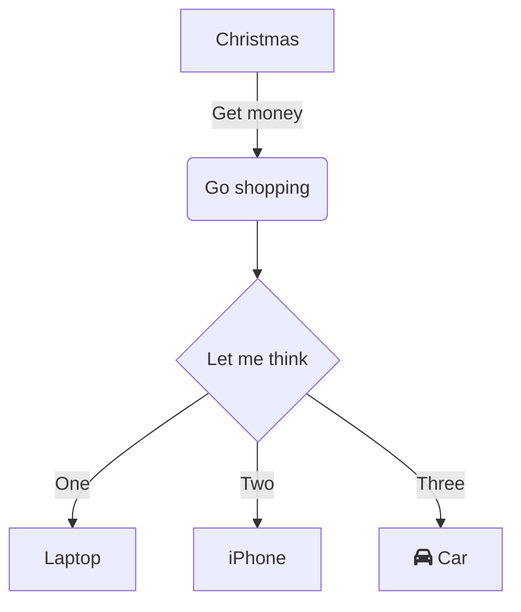

<style>
td.code {
  font-family: "Courier New", monospace;
  font-size: 10px;
  white-space: pre;
  vertical-align: top;
}
</style>

# Header
## sub-header
```java
  Code block
```
*italics*
**bold**

* Bullets
* List
** Nested

1. Numbered
1. List


Flow chart:


<table>
  <thead>
    <th>
      Markdown Table proposal:
    </th>
    <th>
      Example:
    </th>
  </thead>
  <tbody>
    <tr>
      <td class="code">
```
|| < ^
  Header 1
  * left aligned (default)
  * vertical top aligned (default)
|| > v
  Header 2
  * right aligned
  * vertical bottom aligned
|| <> H
  Header 3
  * center aligned
  * vertical center aligned
|
  Row 1, Col 1
| -2
  Row 1, Col 2-3
| |2 >
  Row 2-3, Col 1 right aligned
|
  Row 2, Col 2
|
  Row 2, Col 3
|
  Row 3, Col 2
|
  Row 3, Col 3
```
      </td>
      <td>
        <table>
          <thead>
            <tr>
              <th style="text-align: left;">
                Header 1
                <ul>
                  <li>left aligned (default)</li>
                  <li>vertical top aligned (default)</li>
                </ul>
                <br />
                <br />
                <br />
              </th>
              <th style="text-align: right; vertical-align: bottom;">
                Header 2
                <ul>
                  <li>right aligned</li>
                  <li>vertical bottom aligned (default)</li>
                </ul>
              </th>
              <th style="text-align: center; vertical-align: center;">
                Header 3
                <ul>
                  <li>center aligned</li>
                  <li>vertical center aligned (default)</li>
                </ul>
              </th>
            </tr>
          </thead>
          <tbody>
            <tr>
              <td>
                Row 1, Col 1
              </td>
              <td colspan="2">
                Row 1, Col 2-3
              </td>
            </tr>
            <tr>
              <td rowspan="2" style="text-align: right;">
                Row 2-3, Col 1 right aligned
              </td>
              <td>
                Row 2, Col 2
              </td>
              <td>
                Row 2, Col 3
              </td>
            </tr>
            <tr>
              <td>
                Row 3, Col 2
              </td>
              <td>
                Row 3, Col 3
              </td>
            </tr>
          </tbody>
        </table>
      </td>
    </tr>
  </tbody>
<table>

